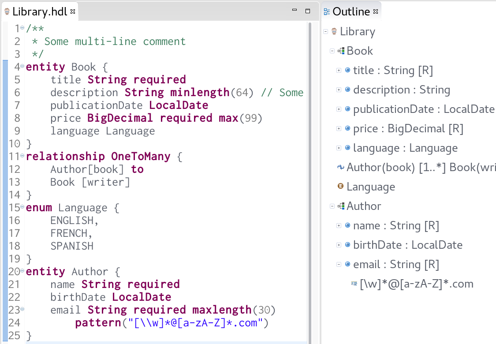
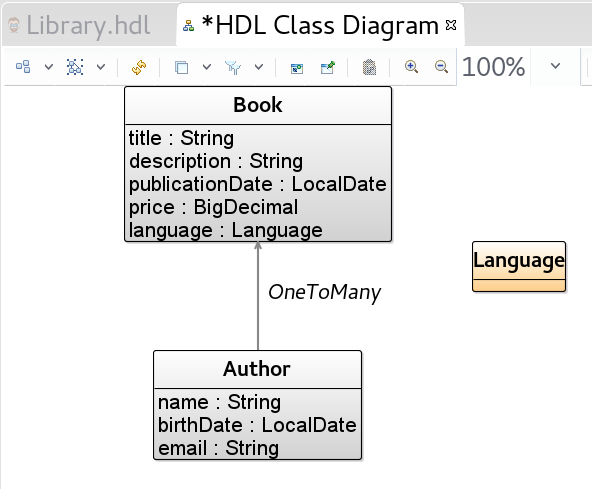

# Yet Another Hipster Domain Language (HDL)

Our own implementation of the [JDL language](https://jhipster.github.io/jhipster-uml/#jdl)., and more. Also, an opportunity to have a look at the [Xtend programming language](http://xtend-lang.org/)! Xtend itself is implemented in Xtext, so it's a good showcase of what can be achieved.

To get started, clone this repository on your filesystem.

## Objectives:
- A textual editor in [Xtext](http://www.eclipse.org/Xtext/)
- A graphical editor in [Sirius](https://eclipse.org/sirius/)
- Some tools around it, e.g. one that merges multiple JDL specifications into one
- Xtext can generate editors for IntelliJ IDEA and the Web. But because I know you love it, we will generate one for Eclipse ;)

## Xtext



*Step 0*: clone this repository and import the projects it contains in Eclipse. (`File -> Import -> Existing projects into workspace`).

### 1 - Specifying the grammar
The central artifact of an Xtext project is the grammar specification (`.xtext` file). To get started, lookup and open the `fr.inria.diverse.hdl/src/fr/inria/diverse/hdl/HipsterDomainLanguage.xtext` file.

Have a look at the examples on the [Xtext grammar language documentation](http://www.eclipse.org/Xtext/documentation/301_grammarlanguage.html) to get you started.

Everytime you update the grammar of your DSL, you need to call Xtext's generator to re-generate the artifacts derived from the grammar (ie. the parser, the metamodel, etc). To do so, Right-click on your .xtext file -> Generate Xtext Artifacts.

It's now a good time to have a look at the generated metamodel. The Ecore file is located in the `fr.inria.diverse.hdl/model/generated/HipsterDomainLanguage.ecore`. The Java API derived from it is located in `fr.inria.diverse.hdl/src-gen/fr/inria/diverse/hdl/hipsterDomainLanguage`.

### 2 - Testing your new editor
Once the new artifacts are generated, they can be deployed as a set of plug-ins in a new Eclipse instance. To try your new editor, Right-click the project fr.inria.diverse.hdl -> Run as -> Eclipse Application. In the new Eclipse instance, create a new project (File  -> New -> Project) and a new file with the extension `.hdl` within it. Xtext automatically binds your new editor to this file extension. Open your new file, and try to enter one of the sample domain model listed [here](http://jhipster.github.io/jhipster_uml.html#jdl). Then, repeat the operation until you're satisfied with your grammar specification.

### 3 - Custom validators
By default, Xtext generates an empty file `fr.inria.diverse.hdl/src/fr/inria/diverse/hdl/validation/HipsterDomainLanguageValidator.xtend` which is injected into the framework as a custom validator for your DSL. Below is a simple custom validator that checks whether each declared Entity starts with an uppercase, and issue a warning otherwise. The framework automatically calls this method when trying to validate an `Entity`.

```
class HipsterDomainLanguageValidator extends AbstractHipsterDomainLanguageValidator
{
	@Check
	def void checkEntityStartsWithUpperCase(Entity e) {
		if (!Character::isUpperCase(e.name.charAt(0)))
			warning(
				// Message displayed to the user
				'Entity name must start with an uppercase',
				// Where to report the error? Here, on the 'name' feature of an 'Entity'
				HipsterDomainLanguagePackage.Literals::ENTITY__NAME
			)
	}
}
```

Now, try to implement your own custom validation (ie. a new method annotated with `@Check` and a proper argument). For example, you can check that the names of the fields of an `Entity` are unique, or that the regex entered by the user are syntactically valid (using `java.util.regex.Pattern::compile(regex)`).

### 4 - A simple tool: merging two HDL specifications into one
Besides the facilities offered by Xtext, we would like to design an additional tool using the API provided by the EMF metamodel. If you select two HDL files and select "Merge", the empty `fr.inria.diverse.hd/src/fr/inria/diverse/hdl/refactoring/DomainMerger::merge(Domain d1, Domain d2)` method will be called. Try to implement this method by looking at the API provided by EMF. To create new elements (entities, relationships, etc.), have a look at the `HipsterDomainLanguageFactory` factory. The goal is to obtain a new domain model (and return it, it will be automatically serialized in the workspace as `Merged.hdl`) that:

- Contains the entities, enums and relationships declared in both .hdl ancestors
- If two entities have the same name, merge their fields
- Implement a basic support for conflict management (eg. the same entity with the same field's name having different types in both .hdl files)

## Sirius
Ok, so we've got a basic textual editor for JDL. But wouldn't it be more convenient to be able to visualize our entity-relation domain model graphically (ie. "boxes and arrows")?

 

When cloning the repository, you obtained a project `fr.inria.diverse.hdl.design`. Within it, you'll find a so-called 'Viewpoint Specification Model' `description/hdl.odesign`. This file specifies how the elements of a model (ie. your `.hdl` file) are projected as graphical elements. Additional documentation can be found at [https://www.eclipse.org/sirius/doc/specifier/diagrams/Diagrams.html](https://www.eclipse.org/sirius/doc/specifier/diagrams/Diagrams.html).


